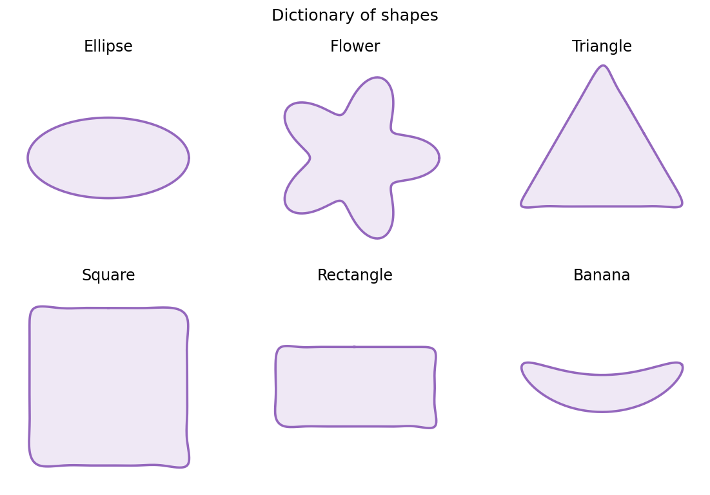
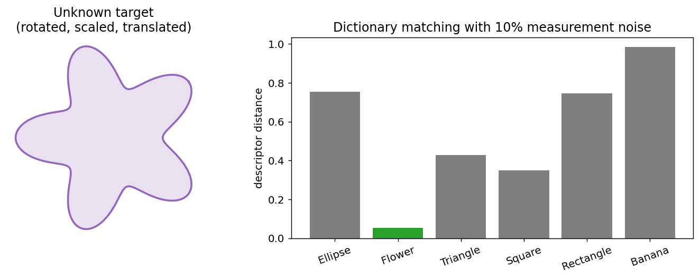
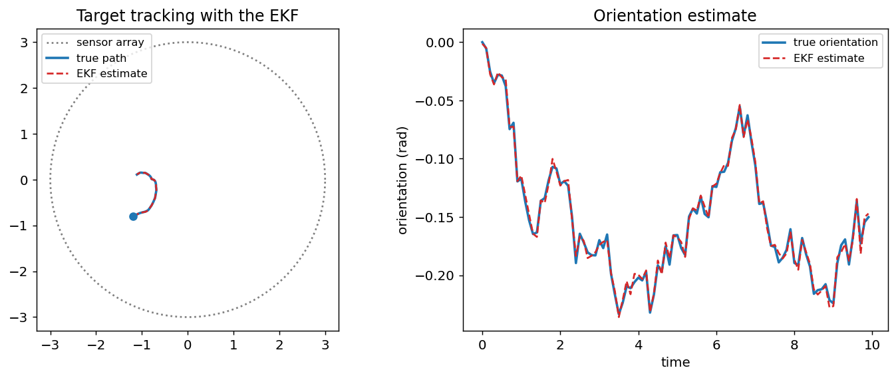

<div align="center">

# SIES — Shape Identification in Electro-Sensing

[](https://github.com/tomboulier/SIES/actions/workflows/ci.yml)
[](https://tomboulier.github.io/SIES/)
[](https://github.com/tomboulier/SIES/actions/workflows/ci.yml)
[](https://github.com/astral-sh/ruff)
[](https://github.com/tomboulier/SIES/blob/master/pyproject.toml)
[](https://marimo.io)

**A Python library for inverse problems in electro-sensing:** simulate
electric measurements of small inclusions, compute their **Generalized
Polarization Tensors**, identify shapes by **dictionary matching**, and
**track** moving targets.

[Documentation](https://tomboulier.github.io/SIES/) ·
[Getting started](https://tomboulier.github.io/SIES/getting-started/) ·
[Theory](https://tomboulier.github.io/SIES/theory/) ·
[API reference](https://tomboulier.github.io/SIES/api/shapes/)

</div>

---

Weakly electric fish sense their environment by emitting an electric field
and measuring its perturbation — a beautiful inverse problem. SIES implements
the mathematical machinery behind this *electro-sensing* paradigm: boundary
integral equations, small-volume asymptotic expansions (GPTs), invariant
shape descriptors, and Kalman filtering.



## Installation

```bash
git clone https://github.com/tomboulier/SIES.git
cd SIES
pip install -e .          # library only
pip install -e .[dev]     # + tests, linting, marimo notebooks
```

## Quick start

Identify an unknown target from noisy electric measurements:

```python
import numpy as np
from sies.shapes import Ellipse, Flower, Rectangle, Triangle
from sies.acquisition import Coincided
from sies.pde import ConductivityR2
from sies.dictionary import ShapeDictionary, ShapeDescriptor

# 1. A dictionary of reference shapes and their invariant descriptors
shapes = [
    Ellipse(1.0, 0.5, 256),
    Flower(1.0, 1.0, 256),
    Triangle(1.0, np.pi / 3, 256),
    Rectangle(1.0, 1.0, 256),
]
dico = ShapeDictionary.build(shapes, cnd=3.0, order=5)

# 2. Noisy measurements of an unknown target (a transformed flower)
target = (Flower(1.0, 1.0, 256).rotate(0.2 * np.pi) * 0.75) + np.array([0.25, 0.25])
cfg = Coincided(np.zeros(2), radius=1.5, nb_src=100)
pde = ConductivityR2(target, cnd=3.0, pmtt=0.0, cfg=cfg)
data = pde.add_white_noise(pde.simulate_data(), level=0.02)

# 3. Reconstruct the polarization tensors and identify the shape
result = pde.reconstruct_cgpt_analytic(data.msr_noisy[0], order=5)
descriptor = ShapeDescriptor.from_cgpt(result.cgpt[0])
print(dico.identify(descriptor, order=3))   # expected: "Flower"
```



The same machinery tracks a moving target online with an Extended Kalman
Filter:



## Features

| Module | What it does |
| --- | --- |
| `sies.shapes` | $C^2$-smooth discretized boundaries (ellipse, flower, triangle, rectangle, banana) with exact differential geometry, rigid motions and spline resampling |
| `sies.operators` | Layer potentials of potential theory: single layer $S_D$, Neumann–Poincaré $K_D^*$, normal derivatives — P0 boundary elements with analytic singular diagonals |
| `sies.asymptotics` | Contracted Generalized Polarization Tensors (CGPT): boundary-integral computation, closed forms for disks/ellipses, exact transformation rules under rigid motions and scaling |
| `sies.acquisition` | Geometry of sources/receivers: concentric circles, full or limited view, grouped arrays |
| `sies.pde` | Conductivity problem: multistatic response simulation (multi-frequency, calibrated noise) and CGPT reconstruction (least squares + closed form) |
| `sies.dictionary` | Translation/rotation/scaling-invariant shape descriptors and dictionary matching |
| `sies.tracking` | Extended Kalman Filter with analytic observation Jacobian for position/orientation tracking |

## Notebooks

Interactive, reproducible [Marimo](https://marimo.io) notebooks (pure Python
files, no hidden state) live in [`notebooks/`](notebooks):

```bash
marimo edit notebooks/dictionary_matching.py
```

- [`cgpt_pipeline.py`](notebooks/cgpt_pipeline.py) — forward & inverse CGPT pipeline, validated against closed forms
- [`dictionary_matching.py`](notebooks/dictionary_matching.py) — full identification experiment with noise-robustness study
- [`target_tracking.py`](notebooks/target_tracking.py) — EKF tracking of a moving target

## Development

```bash
pip install -e ".[dev,docs]"  # all development and documentation extras

pytest --cov=sies            # tests (unit / integration / e2e), coverage > 90% enforced
ruff check src tests         # linting
ruff format src tests        # formatting
mkdocs serve                 # documentation preview
python scripts/generate_figures.py   # regenerate README/docs figures
```

The test suite validates the numerics against closed-form solutions
(machine-precision agreement of the CGPT of disks and ellipses), exact
invariance properties (descriptors under rigid motions), finite-difference
checks (Jacobians, gradients), and end-to-end experiments (identification
under noise, tracking).

> [!NOTE]
> The documentation site is published by the `Docs` workflow on every push to
> `master`. After the first deployment, enable GitHub Pages once in
> *Settings → Pages → deploy from the `gh-pages` branch*; until then the Docs
> badge link returns a 404.

## References

This library reproduces numerical results from:

1. *Target identification using dictionary matching of generalized
   polarization tensors*, Foundations of Computational Mathematics, 2014.
2. *Tracking of a mobile target using generalized polarization tensors*,
   SIAM Journal on Imaging Sciences, 2013.
3. *Shape recognition and classification in electro-sensing*,
   Proceedings of the National Academy of Sciences, 2014.

Not yet covered by the Python port (see the MATLAB legacy below):
*Wavelet methods for shape perception in electro-sensing* and *Shape
identification and classification in echolocation*.

## MATLAB legacy

SIES is a Python port of the MATLAB library written by **Han Wang**
(han.wang@ens.fr). The original MATLAB code is preserved at the repository
root (`+shape/`, `+ops/`, `+asymp/`, `+PDE/`, …) and the
[MATLAB ↔ Python correspondence](https://tomboulier.github.io/SIES/matlab/)
is documented, including the modules not yet ported (Helmholtz/echolocation,
electric fish, pulse imaging, wavelet methods).
